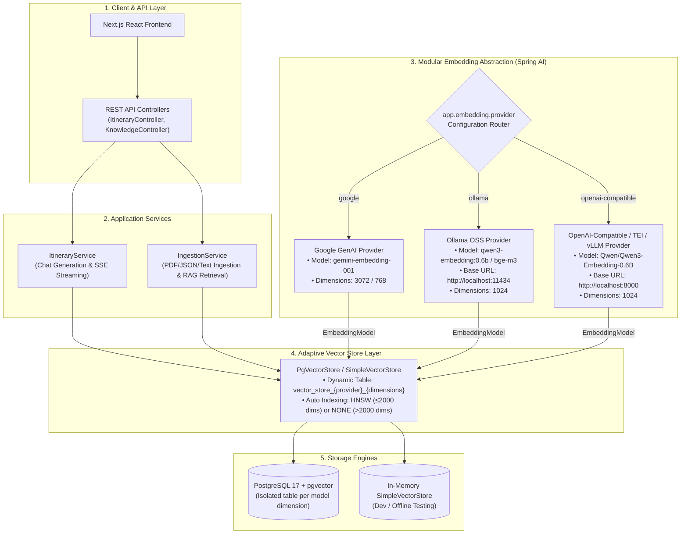

# 🧠 Modular Embedding Architecture & Model Switching Guide

This document outlines the **modular embedding architecture** of the AI Travel Itinerary Planner, explains how to switch between Cloud models (like Google Gemini) and local Open-Source Software (OSS) models (such as `Qwen/Qwen3-Embedding-0.6B`), and details how the system prevents vector dimension collisions in PostgreSQL `pgvector`.

---

## 1. High-Level System Architecture



---

## 2. Key Design Decisions & Invariants

### A. Dynamic Table Isolation (Preventing Dimension Mismatch)
* **Problem**: In PostgreSQL `pgvector`, columns have fixed vector dimensions (e.g. `vector(3072)` for Gemini, `vector(1024)` for Qwen3). Additionally, embeddings from different models inhabit distinct vector spaces and cannot be compared.
* **Solution**: The backend automatically derives the table name as:
  ```
  vector_store_{provider}_{dimensions}
  ```
  - Google Gemini (3072): `vector_store_google_3072`
  - Ollama Qwen3 (1024): `vector_store_ollama_1024`
  - TEI Qwen3 (1024): `vector_store_openai_compatible_1024`
* You can also override the table name explicitly with `app.embedding.table-name` or `EMBEDDING_TABLE_NAME`.

### B. Intelligent Index Selection (HNSW vs Flat)
* `pgvector` HNSW indexes support vector dimensions up to **2,000**.
* When `dimensions <= 2000` (e.g. Qwen3-Embedding-0.6B with 1024 dims), `PgVectorStore` automatically configures **HNSW** for fast approximate nearest neighbor retrieval.
* When `dimensions > 2000` (e.g. Gemini 3072 dims), `PgVectorStore` automatically falls back to **NONE** (exact scan).

---

## 3. Switching Models: Ready-to-Use Recipes

No Java code changes or recompilations are needed to switch models. Simply set the environment variables or update `application.yaml`.

### Recipe 1: Local OSS Model with Ollama (`Qwen3-Embedding-0.6B`)

1. **Pull and run the model in Ollama:**
   ```bash
   ollama pull qwen3-embedding:0.6b
   ```
2. **Start the backend with environment variables:**
   ```bash
   export EMBEDDING_PROVIDER=ollama
   export EMBEDDING_MODEL=qwen3-embedding:0.6b
   export EMBEDDING_DIMENSIONS=1024
   export OLLAMA_BASE_URL=http://localhost:11434
   ```

---

### Recipe 2: High-Performance OSS Model with HuggingFace TEI (`Qwen3-Embedding-0.6B`)

1. **Launch HuggingFace Text Embeddings Inference (TEI) container:**
   ```bash
   docker run --gpus all -p 8000:80 -v $HOME/.cache/huggingface:/data \
     ghcr.io/huggingface/text-embeddings-inference:latest \
     --model-id Qwen/Qwen3-Embedding-0.6B --port 80
   ```
2. **Start the backend with environment variables:**
   ```bash
   export EMBEDDING_PROVIDER=openai-compatible
   export EMBEDDING_MODEL=Qwen/Qwen3-Embedding-0.6B
   export EMBEDDING_DIMENSIONS=1024
   export OPENAI_COMPAT_BASE_URL=http://localhost:8000
   ```

---

### Recipe 3: Cloud Provider with Google Gemini (`gemini-embedding-001`)

```bash
export EMBEDDING_PROVIDER=google
export EMBEDDING_MODEL=gemini-embedding-001
export EMBEDDING_DIMENSIONS=3072
export GEMINI_API_KEY=your_gemini_api_key
```

---

## 4. Configuration Reference (`application.yaml`)

```yaml
app:
  vectorstore:
    type: ${VECTORSTORE_TYPE:pgvector} # Options: pgvector, simple
  embedding:
    # Options: google, ollama, openai-compatible
    provider: ${EMBEDDING_PROVIDER:google}
    model: ${EMBEDDING_MODEL:gemini-embedding-001}
    dimensions: ${EMBEDDING_DIMENSIONS:3072}
    table-name: ${EMBEDDING_TABLE_NAME:} # Blank = auto vector_store_{provider}_{dimensions}
    ollama:
      base-url: ${OLLAMA_BASE_URL:http://localhost:11434}
    openai-compatible:
      base-url: ${OPENAI_COMPAT_BASE_URL:http://localhost:8000}
      api-key: ${OPENAI_COMPAT_API_KEY:dummy-key}
```

---

## 5. Verification and Status API

Check the currently active embedding configuration and document counts by calling:

```bash
curl http://localhost:8080/api/knowledge/status
```

Example JSON response:
```json
{
  "status": "ready",
  "totalDocumentsIngested": 12,
  "destinations": ["Kyoto", "Tokyo"],
  "documentCountByDestination": {
    "Kyoto": 8,
    "Tokyo": 4
  },
  "embeddingProvider": "ollama",
  "embeddingModel": "qwen3-embedding:0.6b",
  "embeddingDimensions": 1024,
  "vectorTable": "vector_store_ollama_1024"
}
```
