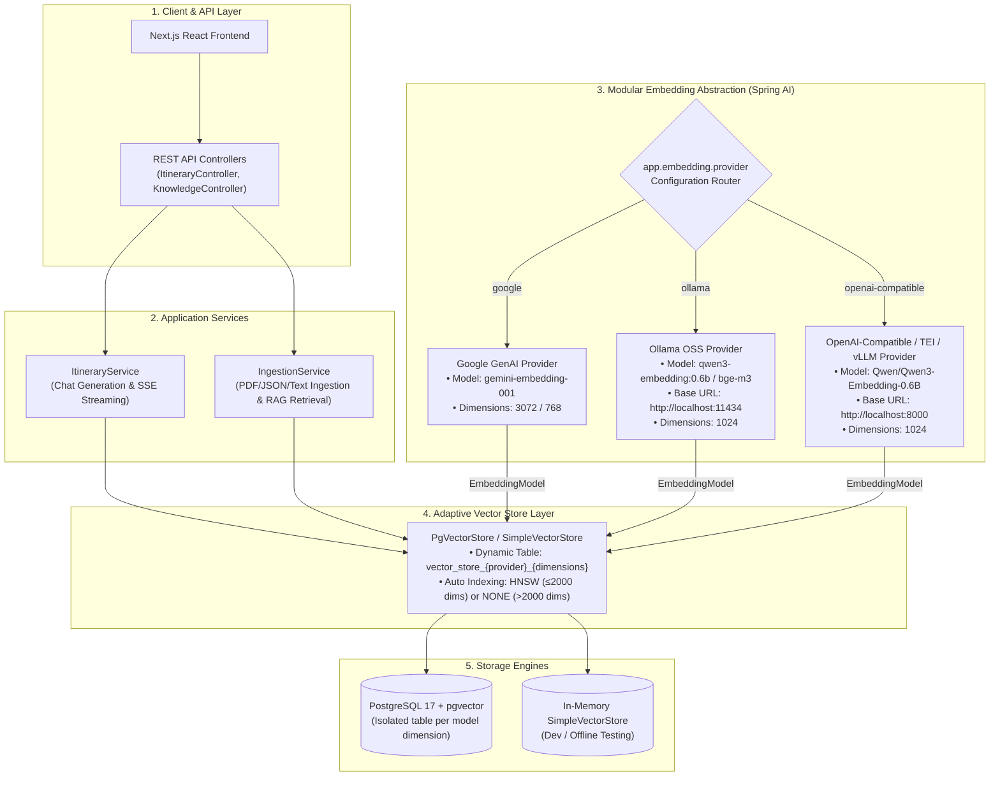

# 🧠 Modular Embedding Architecture & Model Switching Guide

This document outlines the **modular embedding architecture** of the AI Travel Itinerary Planner, explains how to switch between Cloud models (like Google Gemini) and local Open-Source Software (OSS) models (such as `Qwen/Qwen3-Embedding-0.6B`), and details how the system prevents vector dimension collisions in PostgreSQL `pgvector`.

---

## 1. High-Level System Architecture



---

## 2. Key Design Decisions & Invariants

### A. Dynamic Table Isolation (Preventing Dimension Mismatch)
* **Problem**: In PostgreSQL `pgvector`, columns have fixed vector dimensions (e.g. `vector(3072)` for Gemini, `vector(1024)` for Qwen3). Additionally, embeddings from different models inhabit distinct vector spaces and cannot be compared.
* **Solution**: The backend automatically derives the table name as:
  ```
  vector_store_{provider}_{dimensions}
  ```
  - Google Gemini (3072): `vector_store_google_3072`
  - Ollama Qwen3 (1024): `vector_store_ollama_1024`
  - TEI Qwen3 (1024): `vector_store_openai_compatible_1024`
* You can also override the table name explicitly with `app.embedding.table-name` or `EMBEDDING_TABLE_NAME`.

### B. Intelligent Index Selection (HNSW vs Flat)
* `pgvector` HNSW indexes support vector dimensions up to **2,000**.
* When `dimensions <= 2000` (e.g. Qwen3-Embedding-0.6B with 1024 dims), `PgVectorStore` automatically configures **HNSW** for fast approximate nearest neighbor retrieval.
* When `dimensions > 2000` (e.g. Gemini 3072 dims), `PgVectorStore` automatically falls back to **NONE** (exact scan).

---

## 3. Step-by-Step Model Switching Workflow

Switching embedding models requires **zero code changes or recompilation**. Follow this 5-step checklist:

1. **Step 1: Ensure Target Embedding Service is Running**
   - *Ollama*: `ollama pull qwen3-embedding:0.6b` and ensure Ollama daemon is running.
   - *HuggingFace TEI / vLLM*: Start the inference container on port `8000`.
   - *Google Gemini*: Ensure `GEMINI_API_KEY` is exported.
2. **Step 2: Set Environment Variables**
   - Export `EMBEDDING_PROVIDER`, `EMBEDDING_MODEL`, `EMBEDDING_DIMENSIONS`, and the corresponding base URL or API key (see recipes below).
3. **Step 3: Restart the Backend Application**
   - Start or restart the Spring Boot backend (`./gradlew bootRun`).
   - The backend automatically selects the target table (`vector_store_{provider}_{dimensions}`) and sets the proper index (HNSW for $\le 2000$ dims).
4. **Step 4: Ingest Knowledge Documents for the New Vector Space**
   - Because embeddings from different models inhabit distinct vector spaces, upload/preload documents into the newly selected table (see [Section 5: Document Ingestion Guide](#5-document-ingestion--knowledge-api-guide)).
5. **Step 5: Verify Active Status**
   - Check `GET /api/knowledge/status` to confirm the active provider, model, dimensions, and table name.

---

## 4. Switching Models: Ready-to-Use Recipes

No Java code changes or recompilations are needed to switch models. Simply set the environment variables or update `application.yaml`.

### Recipe 1: Local OSS Model with Ollama (`Qwen3-Embedding-0.6B`)

1. **Pull and run the model in Ollama:**
   ```bash
   ollama pull qwen3-embedding:0.6b
   ```
2. **Start the backend with environment variables:**
   ```bash
   export EMBEDDING_PROVIDER=ollama
   export EMBEDDING_MODEL=qwen3-embedding:0.6b
   export EMBEDDING_DIMENSIONS=1024
   export OLLAMA_BASE_URL=http://localhost:11434
   ```

---

### Recipe 2: High-Performance OSS Model with HuggingFace TEI (`Qwen3-Embedding-0.6B`)

1. **Launch HuggingFace Text Embeddings Inference (TEI) container:**
   ```bash
   docker run --gpus all -p 8000:80 -v $HOME/.cache/huggingface:/data \
     ghcr.io/huggingface/text-embeddings-inference:latest \
     --model-id Qwen/Qwen3-Embedding-0.6B --port 80
   ```
2. **Start the backend with environment variables:**
   ```bash
   export EMBEDDING_PROVIDER=openai-compatible
   export EMBEDDING_MODEL=Qwen/Qwen3-Embedding-0.6B
   export EMBEDDING_DIMENSIONS=1024
   export OPENAI_COMPAT_BASE_URL=http://localhost:8000
   ```

---

### Recipe 3: Cloud Provider with Google Gemini (`gemini-embedding-001`)

```bash
export EMBEDDING_PROVIDER=google
export EMBEDDING_MODEL=gemini-embedding-001
export EMBEDDING_DIMENSIONS=3072
export GEMINI_API_KEY=your_gemini_api_key
```

---

## 5. Document Ingestion & Knowledge API Guide

The backend provides four flexible ingestion pathways to load travel knowledge into the active `pgvector` store. All ingestion methods feature **deterministic deduplication** (idempotent SHA-256 UUIDs) to prevent duplicate vector rows.

### A. Ingest Structured Travel Documents (`POST /api/knowledge/documents`)

Ingest an array of rich travel items (attractions, restaurants, landmarks) with structured metadata.

```bash
curl -X POST "http://localhost:8080/api/knowledge/documents?destination=Kyoto" \
  -H "Content-Type: application/json" \
  -d '[
    {
      "id": "kyoto-fushimi-inari",
      "destination": "Kyoto",
      "title": "Fushimi Inari Taisha",
      "category": "shrine",
      "district": "Fushimi",
      "content": "Famous Shinto shrine dedicated to the god of rice and agriculture, renowned for its thousands of vermilion torii gates winding up Mount Inari.",
      "tags": ["shrine", "historic", "torii-gates"],
      "suggestedDuration": "2-3 hours",
      "bestTimeToVisit": "Early morning or dusk to avoid crowds",
      "metadata": {
        "admission": "Free",
        "nearestStation": "JR Inari Station"
      }
    },
    {
      "id": "kyoto-kinkakuji",
      "destination": "Kyoto",
      "title": "Kinkaku-ji (Golden Pavilion)",
      "category": "temple",
      "district": "Kita",
      "content": "Zen Buddhist temple covered in gold leaf overlooking the Kyoko-chi mirror pond.",
      "tags": ["temple", "unesco", "zen"],
      "suggestedDuration": "1-2 hours",
      "bestTimeToVisit": "Morning opening hours",
      "metadata": {
        "admission": "500 JPY"
      }
    }
  ]'
```

**JSON Field Reference for `TravelDocumentDto`**:
* `id` *(optional)*: Unique string ID. If omitted, a deterministic SHA-256 UUID is generated automatically from content.
* `destination` *(optional)*: City or region (e.g. `"Kyoto"`, `"Tokyo"`).
* `title` *(required)*: Name of the landmark or attraction.
* `category` *(optional)*: E.g. `"attraction"`, `"temple"`, `"shrine"`, `"restaurant"`, `"museum"`.
* `district` *(optional)*: Neighborhood or area (e.g. `"Higashiyama"`, `"Arashiyama"`).
* `content` *(required)*: Detailed description or guide text used for embeddings and RAG retrieval.
* `tags` *(optional)*: Array of string tags (e.g. `["culture", "view"]`).
* `suggestedDuration` *(optional)*: E.g. `"2 hours"`.
* `bestTimeToVisit` *(optional)*: E.g. `"Morning"`.
* `metadata` *(optional)*: Custom key-value map for additional properties.

---

### B. Ingest Raw Travel Articles (`POST /api/knowledge/articles`)

Quickly ingest free-form travel blog posts, notes, or article paragraphs for a destination.

```bash
curl -X POST "http://localhost:8080/api/knowledge/articles" \
  -H "Content-Type: application/json" \
  -d '{
    "destination": "Osaka",
    "articles": [
      "Dotonbori is Osaka’s most vibrant nightlife and dining district, famous for its giant neon signs like the Glico Running Man and street food stalls serving fresh Takoyaki.",
      "Osaka Castle (Osakajo) is a historic Japanese fortress surrounded by secondary citadels, moats, and Nishinomaru Garden containing over 600 cherry trees."
    ]
  }'
```

---

### C. File Upload Ingestion (`POST /api/knowledge/upload`)

Upload travel guide files directly via `multipart/form-data`. The backend automatically parses and chunks the file based on format:

1. **PDF Documents (`.pdf`)**: Parsed page-by-page and split into token chunks using `TokenTextSplitter`.
2. **JSON Datasets (`.json`)**: Supports arrays of `TravelDocumentDto`, arrays of raw strings, or objects with `"documents"`/`"articles"` wrappers.
3. **Plain Text / Markdown (`.txt`, `.md`)**: Automatically segmented by double newlines into distinct article sections.

**Example: Upload a PDF Travel Guide**:
```bash
curl -X POST "http://localhost:8080/api/knowledge/upload" \
  -F "file=@/path/to/kyoto_guide.pdf" \
  -F "destination=Kyoto"
```

**Example: Upload a JSON Document File**:
```bash
curl -X POST "http://localhost:8080/api/knowledge/upload" \
  -F "file=@/path/to/tokyo_knowledge.json" \
  -F "destination=Tokyo"
```

---

### D. Preloaded Destination Ingestion (`POST /api/knowledge/preload`)

Trigger ingestion of bundled dataset files packaged in the backend classpath (located under `classpath:data/{destination}/{destination}_travel_knowledge.json`).

```bash
curl -X POST "http://localhost:8080/api/knowledge/preload?destination=Kyoto"
```

---

## 6. Configuration Reference (`application.yaml`)

```yaml
app:
  vectorstore:
    type: ${VECTORSTORE_TYPE:pgvector} # Options: pgvector, simple
  embedding:
    # Options: google, ollama, openai-compatible
    provider: ${EMBEDDING_PROVIDER:google}
    model: ${EMBEDDING_MODEL:gemini-embedding-001}
    dimensions: ${EMBEDDING_DIMENSIONS:3072}
    table-name: ${EMBEDDING_TABLE_NAME:} # Blank = auto vector_store_{provider}_{dimensions}
    ollama:
      base-url: ${OLLAMA_BASE_URL:http://localhost:11434}
    openai-compatible:
      base-url: ${OPENAI_COMPAT_BASE_URL:http://localhost:8000}
      api-key: ${OPENAI_COMPAT_API_KEY:dummy-key}
```

---

## 7. Verification & Search APIs

### A. Check RAG Status & Ingested Document Counts
```bash
curl http://localhost:8080/api/knowledge/status
```

Example response:
```json
{
  "status": "ready",
  "totalDocumentsIngested": 12,
  "destinations": ["Kyoto", "Tokyo"],
  "documentCountByDestination": {
    "Kyoto": 8,
    "Tokyo": 4
  },
  "embeddingProvider": "ollama",
  "embeddingModel": "qwen3-embedding:0.6b",
  "embeddingDimensions": 1024,
  "vectorTable": "vector_store_ollama_1024"
}
```

### B. Test Vector Similarity Search Directly
Test semantic similarity search without generating an itinerary:
```bash
curl "http://localhost:8080/api/knowledge/similarity-search?query=zen+temple+with+gardens&topK=3"
```
