# RAG Deduplication & Intelligent Itinerary Synthesis Plan

This document outlines the root causes, architecture, and remediation strategy for preventing duplicate locations and mitigating RAG over-reliance in the Smart Travel Itinerary Planner.

---

## 1. Problem Statement

When travel documents (e.g., Kyoto temple guides, sightseeing PDFs, regional articles) are ingested into the vector store:
1. **RAG Context Over-Fitting**: The LLM treats the retrieved context documents as an exhaustive checklist rather than reference material, forcibly including all retrieved locations even when they do not fit the user's duration, pacing, or travel style.
2. **Duplicate Location Repetition**: The same landmark or attraction is frequently scheduled multiple times across different days or within the same day plan.
3. **Inefficient Travel Routing**: Without geographic clustering rules, the generator can schedule attractions on opposite sides of a city on the same day.

---

## 2. Root Cause Analysis

```mermaid
flowchart TD
    subgraph IngestionIssues ["1. Ingestion Layer"]
        A1[Re-uploading articles/files] --> A2[Multiple chunks with identical landmarks]
        A2 --> A3[No deterministic hash IDs or chunk deduplication]
    end

    subgraph RetrievalIssues ["2. Retrieval Layer"]
        B1[QuestionAnswerAdvisor default topK] --> B2[Weak similarity threshold]
        B2 --> B3[No destination metadata filtering]
        B3 --> B4[Multiple overlapping chunks injected into LLM prompt]
    end

    subgraph GenerationIssues ["3. LLM Prompt Layer"]
        C1[Generic system prompt] --> C2[No uniqueness constraint across days]
        C2 --> C3[No guidance on RAG vs parametric model knowledge]
        C3 --> C4[Output contains duplicated locations & erratic pacing]
    end
```

1. **Unconstrained Ingestion**:
   - `IngestionService.java` generates random UUIDs (`UUID.randomUUID().toString()`) for chunks and documents. Uploading similar documents multiple times creates duplicate embeddings in `pgvector`.
2. **Unfiltered & Redundant Retrieval**:
   - `AiConfig.java` attaches a default `QuestionAnswerAdvisor` without a similarity threshold or destination metadata filter, feeding redundant or loosely matching chunks to the LLM.
3. **Lack of LLM Generation Guardrails**:
   - The system prompt in `AiConfig.java` enforces output format and conciseness, but lacks explicit rules regarding:
     - Multi-day location uniqueness.
     - Selective synthesis (prioritizing quality over forcing all retrieved items).
     - Geographic grouping per day.

---

## 3. Remediation Strategy

### A. Prompt Engineering & LLM Synthesis (Immediate & High Impact)

Update the system prompt and advisor prompt template in [`AiConfig.java`](../backend/src/main/java/com/yonglun/itineraryassistant/config/AiConfig.java) and [`ItineraryService.java`](../backend/src/main/java/com/yonglun/itineraryassistant/service/ItineraryService.java) with explicit operational rules:

1. **Location Uniqueness Invariant**:
   - *"Each attraction, museum, restaurant, landmark, or specific venue MUST appear at most once across the entire multi-day itinerary. Do not repeat visited locations on subsequent days unless explicitly requested by the user."*
2. **Selective RAG Utilization**:
   - *"Treat retrieved context documents as inspirational recommendations. Do NOT attempt to incorporate every retrieved location. Select only the most relevant, highly-rated spots that fit the user's pace and preferences."*
3. **Geographic Clustering & Flow**:
   - *"Cluster activities geographically by neighborhood/district for each day to minimize commute times and prevent zigzagging across the city."*
4. **Realistic Daily Pacing**:
   - *"Limit activities to a realistic 2 to 4 major activities per day (Morning, Afternoon, Evening) with appropriate transit time between stops."*

---

## B. Retrieval Tuning & Destination Metadata Filtering

1. **Similarity Score Threshold**:
   - Configure `QuestionAnswerAdvisor` with a similarity threshold (e.g. `0.68`–`0.72`) to filter out low-relevance chunks.
2. **Dynamic Destination Filter Expression**:
   - When generating an itinerary for a specific destination (e.g. `destination == 'Kyoto'`), pass a metadata filter expression to `QuestionAnswerAdvisor` or `SearchRequest` so unrelated knowledge chunks from other cities are excluded.
3. **Context Top-K Limits**:
   - Constrain `topK` to 4–6 high-quality chunks to prevent prompt bloating.

---

## C. Ingestion-Time Deduplication & Normalization

1. **Deterministic Document IDs (Content Hashing)**:
   - In [`IngestionService.java`](../backend/src/main/java/com/yonglun/itineraryassistant/service/IngestionService.java), generate document IDs using a SHA-256 hash of normalized content:
     $$\text{ID} = \text{SHA-256}(\text{destination} + \text{title} + \text{content})$$
   - Re-ingesting or updating the same document replaces the existing vector row rather than creating redundant embeddings.
2. **Batch Pre-filtering**:
   - Deduplicate documents in-memory by normalized title/text before storing in `pgvector`.

---

## D. Optional Backend Post-Processing Guardrail

In [`ItineraryService.java`](../backend/src/main/java/com/yonglun/itineraryassistant/service/ItineraryService.java):
* Perform a fast programmatic scan over the structured `Itinerary` record:
  - Track a `Set<String> seenLocations` across all `DayPlan` and `Activity` entries.
  - Log warnings or dynamically flag duplicate activity titles/locations before sending to the client.

---

## 4. Implementation Roadmap

| Phase | Target Component | Key Deliverables |
| :--- | :--- | :--- |
| **Phase 1** | `AiConfig.java` / `ItineraryService.java` | Refine system prompt & RAG template with uniqueness, selective context, and geographic clustering invariants. |
| **Phase 2** | `AiConfig.java` | Configure `QuestionAnswerAdvisor` with similarity threshold and optimized top-K. |
| **Phase 3** | `IngestionService.java` | Introduce deterministic SHA-256 ID generation and in-memory batch deduplication. |
| **Phase 4** | Verification & Testing | Execute backend unit/integration tests (`./gradlew test`) with multi-day itinerary prompts to verify zero duplicate locations. |

---

## 5. Relevant Code References

- [`AiConfig.java`](../backend/src/main/java/com/yonglun/itineraryassistant/config/AiConfig.java): ChatClient & QuestionAnswerAdvisor configuration.
- [`ItineraryService.java`](../backend/src/main/java/com/yonglun/itineraryassistant/service/ItineraryService.java): Itinerary generation and streaming logic.
- [`IngestionService.java`](../backend/src/main/java/com/yonglun/itineraryassistant/service/IngestionService.java): Document ingestion, PDF/JSON chunking, and VectorStore storage.
- [`EMBEDDINGS.md`](EMBEDDINGS.md): Vector store tables and embedding models reference.
